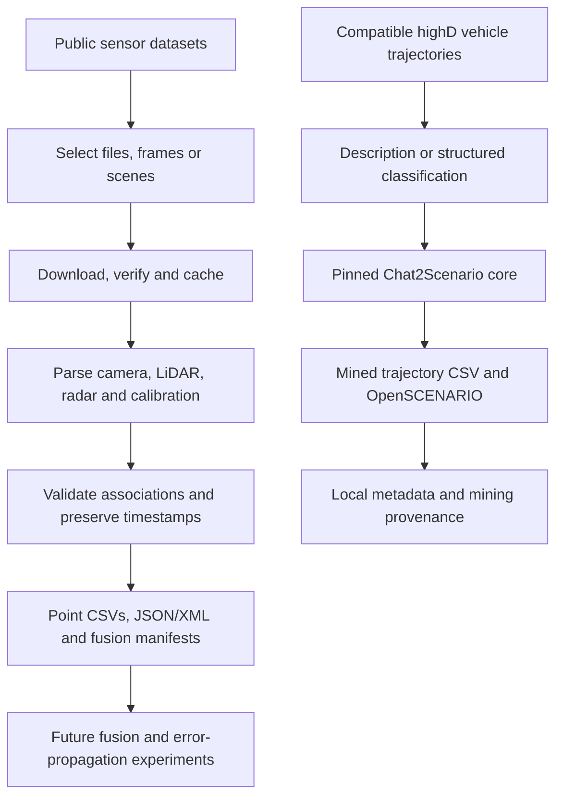

# Sensor Fusion Data Toolkit

A Python toolkit for downloading public driving data, extracting camera, LiDAR, radar and calibration metadata, and exporting traceable inputs for sensor-fusion research. It also connects compatible vehicle trajectories to the authors' **Chat2Scenario** mining code.

The research goal is to study **error propagation in sensor fusion**. This repository implements acquisition, validation, sensor pairing, CSV export and metadata preparation. Fusion algorithms, uncertainty models and error-propagation experiments are future work.

The metadata extractor is our **`paper-inspired-local` implementation**, informed by the [NPL metadata paper](https://doi.org/10.1016/j.measen.2024.101458). It does not access or validate NPL's internal application or Hitachi Content Platform. JSON/XML use our own schema, not an unpublished NPL API or XSD.

## What is implemented

- **A2D2 camera + LiDAR:** paired images/point clouds, full calibration, every point as CSV, previews and joint metadata.
- **RadarScenes radar + camera:** selective ZIP downloads, HDF5 parsing, associated images, detection/odometry CSVs and timing-aware pair manifests.
- **Metadata benchmarks:** checksum-pinned samples from comma2k19, Udacity and A2D2, plus an optional Astyx radar/calibration benchmark.
- **Local annotation:** images, CSV/TSV, recognized calibration JSON, A2D2 NPZ, RadarScenes HDF5 and supported Velodyne classic PCAP.
- **Chat2Scenario:** actual pinned upstream mining on compatible highD trajectories, followed by metadata annotation of trajectory CSV and OpenSCENARIO exports.

## How the pipeline fits together



These workflows currently have different inputs. Camera pixels and radar/LiDAR point CSVs cannot be fed directly into Chat2Scenario. Connecting them requires perception/tracking and a validated conversion to vehicle boxes, continuous trajectories, lanes and neighbouring-vehicle relationships. That conversion is not implemented.

## Installation

Use **Python 3.12**, the tested version. The package declares support for Python 3.10–3.13; Python 3.14 is outside its dependency range.

```sh
git clone https://github.com/Balo-97/sensor-fusion-data-toolkit.git
cd sensor-fusion-data-toolkit
```

Windows PowerShell:

```powershell
py -3.12 -m venv .venv
.\.venv\Scripts\Activate.ps1
python -m pip install -e ".[a2d2,radarscenes,mining,test]"
```

Linux/macOS, with Python 3.12 installed:

```sh
python3.12 -m venv .venv
source .venv/bin/activate
python -m pip install -e ".[a2d2,radarscenes,mining,test]"
```

Commands below assume this environment is active. If PowerShell blocks activation, use `.\.venv\Scripts\python.exe` in place of `python`, including the installation command; changing system execution policy is unnecessary.

| Installation | Purpose |
|---|---|
| `python -m pip install -e .` | Images, CSV/JSON, default benchmark and Astyx samples |
| `python -m pip install -e ".[a2d2]"` | Camera/LiDAR NPZ support with NumPy |
| `python -m pip install -e ".[radarscenes]"` | RadarScenes with h5py and NumPy |
| `python -m pip install -e ".[mining,test]"` | Chat2Scenario dependencies and software tests |

`requirements-tested.txt` records the tested Windows/Python 3.12 environment; it is not a universal lockfile. The Python distribution remains `scenario-metadata-pipeline`; the import/CLI module is `scenario_metadata`.

## Start with camera and LiDAR: A2D2

```sh
python -m scenario_metadata a2d2 run --output outputs/a2d2-first
```

This downloads frame IDs **60, 61 and 62** from sequence `20180810_150607`, camera `front_center`: three PNGs, three frame JSONs, three LiDAR NPZs, full calibration, README and license. The verified selection totals **12 files / 13,156,094 bytes**. No account is required.

The pipeline checks source image/point-cloud references, frame/view identity, calibration structure, sensor IDs and image dimensions. It annotates both modalities and exports:

```text
outputs/a2d2-first/
  inputs/<frame>/                 original PNG, JSON and NPZ copies
  cams_lidars.json                original calibration configuration
  points/000000060.csv            all 18,199 points for frame 60
  points/000000060.preview.csv    first 100 points
  metadata/                      per-file JSON/XML annotations
  fusion_pairs.csv               one summary row per paired frame
  fusion_manifest.json           associations, hashes, timing and calibration
  fusion_manifest.xml
  a2d2_report.json                compact status and coverage
```

Point CSVs preserve source row order, XYZ, sensor IDs, reflectance, integer timestamps and available projection fields. Import long timestamp columns as **text** in spreadsheet software to preserve every digit. Use `--no-point-csv` to omit full point CSVs and previews.

Download the next three frame IDs:

```sh
python -m scenario_metadata a2d2 run --start-frame 63 --max-frames 3
```

Change `--sequence` and `--camera` for another selection. Requested IDs must exist; a missing file fails explicitly. Increase `--max-download-mb` and `--max-file-mb` for larger selections; defaults are 100 MB total and 25 MB per file.

Separate acquisition from offline annotation:

```sh
python -m scenario_metadata a2d2 download --start-frame 60 --max-frames 3
python -m scenario_metadata a2d2 annotate --start-frame 60 --max-frames 3
```

**Coordinates and timing:** the NPZ clouds are already registered to camera views. Applying a raw LiDAR-to-camera transform again would use the wrong starting frame. Point `timestamp`, `rectime`, camera time and calibration delays remain distinct; recorded-time differences are not calibrated acquisition latencies. These frames contain returns from all five physical LiDAR units, but adjacent clouds can reuse measurements. See the [A2D2 guide](docs/a2d2-fusion.md) for columns, calibration and timing details.

## Radar and camera: RadarScenes

```sh
python -m scenario_metadata radarscenes run --sequence sequence_158 --max-scenes 25
```

This retrieves the selected sequence's HDF5/scene JSON, shared sensor information and unique camera images referenced by the selected measurements. A RadarScenes **scene is one radar measurement**, not a mined driving scenario. The first 25 measurements in sequence 158 contain 2,309 detections and share two images.

```sh
# Process measurements 25–49, reusing the cached radar sequence.
python -m scenario_metadata radarscenes run --sequence sequence_158 --start-scene 25 --max-scenes 25

# Discover sequences, ordered by compressed radar-file size.
python -m scenario_metadata radarscenes list

# Flag pairs outside an experimental absolute time-offset limit.
python -m scenario_metadata radarscenes run --sequence sequence_158 --max-scenes 25 --max-camera-offset-ms 50
```

Outputs include `detections.csv`, `odometry.csv`, calibration/scene references, camera images, JSON/XML metadata, `fusion_pairs.csv`, a joint manifest and a run report. Time thresholds flag pairs without dropping them. Use `--no-camera` to skip images.

RadarScenes has **no LiDAR**. Its documentary images and available radar mounting poses do not supply the camera intrinsics and radar-to-camera extrinsics needed for calibrated projection. Shared images and timing offsets must be considered in fusion studies. See the [RadarScenes guide](docs/radarscenes.md).

## Where the datasets come from

| Dataset | Implemented selection | Source and acquisition |
|---|---|---|
| [A2D2](https://registry.opendata.aws/aev-a2d2/) | Paired camera/LiDAR frames and full sensor configuration; separate small benchmark images | Public HTTPS objects from Audi's AWS Open Data bucket; no account. Paired downloader checks size/MD5-style ETag and records SHA-256. |
| [RadarScenes](https://zenodo.org/records/4559821) | Sequence HDF5/JSON, associated JPEGs and sensor poses | Official Zenodo ZIP; no account. HTTP Range requests retrieve its directory and selected members; size/CRC checks plus local SHA-256. Whole-ZIP MD5 is not verified. |
| [comma2k19](https://github.com/commaai/comma2k19) | One original preview PNG | Commit-pinned public GitHub file with manifest SHA-256; no account. |
| [Udacity](https://github.com/udacity/self-driving-car) | Calibration PNG and CrowdAI annotation CSV | Commit-pinned public GitHub files with SHA-256; no account. Sample artifacts, not a synchronized sensor recording. |
| [Astyx public copy](https://github.com/under-the-radar/radar_dataset_astyx) | Three radar TXT files, three calibration JSONs and license | Commit-pinned public GitHub files with SHA-256; no account. Corresponding camera/LiDAR files are not downloaded by this pilot. |
| [highD](https://levelxdata.com/highd-dataset/) | User-supplied compatible `xx_tracks.csv` for mining | Obtain access from the provider. No automatic downloader or redistribution is included. |

Attribution, license links, exact URLs and pinned hashes are in [the sample manifest](src/scenario_metadata/datasets.json), [Astyx manifest](configs/radar-samples.json) and downloaded publisher notices. Reuse remains subject to each provider's terms. Data, outputs and downloaded upstream source are excluded from this repository.

## Check extraction on three public datasets

```sh
python -m scenario_metadata datasets
python -m scenario_metadata benchmark
python -m scenario_metadata benchmark --datasets comma2k19 a2d2 --output outputs/smaller-benchmark
python -m scenario_metadata benchmark --manifest configs/radar-samples.json --output outputs/astyx-benchmark
```

The default benchmark downloads **seven files / 14,257,235 bytes** across comma2k19, Udacity and A2D2. Checks include 1164×874 RGB and 640×480 grayscale images, 1920×1208 A2D2 images, and the Udacity CSV's 72,064 rows and seven columns. This is a small correctness benchmark, not full-dataset or performance evaluation.

Reports go to `outputs/benchmark/`, including `benchmark_report.json`, a Markdown summary and per-file annotations. Failed downloads or checks return a nonzero exit status.

To add direct-download files, copy the sample manifest structure, provide HTTPS URLs and independently established SHA-256 values, and use `--manifest`. The generic downloader requires hashes and does not implement authenticated portals or archive extraction. Dedicated adapters handle A2D2 frame selection and RadarScenes ZIP access.

```sh
python -m scenario_metadata download --manifest configs/my-datasets.json --max-file-mb 500
python -m scenario_metadata benchmark --manifest configs/my-datasets.json --output outputs/custom-benchmark
```

## How metadata extraction works

```sh
python -m scenario_metadata annotate path/to/files --output outputs/annotations
python -m scenario_metadata annotate path/to/table.csv --csv-delimiter ';' --csv-no-header --output outputs/headerless
```

The extractor hashes each original file, records file properties, dispatches to a recognized format parser and writes `.metadata.json` and `.metadata.xml` sidecars. Unsupported formats retain generic metadata and diagnostics.

| Input | Extracted information |
|---|---|
| PNG/JPEG | Decode status, dimensions, encoding and available EXIF/exposure fields |
| CSV/TSV | Headers, types, missing/nonfinite values, numeric ranges and malformed-row diagnostics |
| Recognized calibration JSON | Source fields, intrinsics, poses and matrix structure checks for supported Astyx, A2D2 and RadarScenes layouts |
| A2D2 NPZ | Point-array structure, source-key mapping, sensor counts, ranges and timing |
| RadarScenes HDF5 | Radar/odometry structure, counts and bounded summaries |
| Supported Velodyne classic PCAP | Recognized packet fields and bounded observed rotation-rate estimates |
| Mined CSV/OpenSCENARIO | File metadata plus actors, intervals, classification and mining provenance |

Summaries are bounded: CSV scans at most 100,000 rows/32 MiB; generic NPZ/HDF5 summaries use at most 100,000 rows. Sampling is explicit. Joint manifests summarize selected data; A2D2 full CSV exports preserve all points within documented NPZ limits. Hashes cover complete files. See [parser details](docs/radar-and-calibration.md) and the dataset guides.

Filesystem timestamps are **not capture timestamps**. Missing exposure, weather, uncertainty and calibration are not inferred. XML uses `urn:scenario-metadata:local:v1`; well-formedness does not establish NPL-schema conformity. Livox LVX, PCAPNG and arbitrary radar binary formats have no sensor decoder here.

## Chat2Scenario: mine trajectories, then annotate

Bootstrap downloads eight required upstream files into ignored `vendor/Chat2Scenario`, pinned to commit [`a396c0d`](https://github.com/ftgTUGraz/Chat2Scenario/tree/a396c0d86fcf551a3901f299e0654754ba87918f) and verified by normalized-source SHA-256.

```sh
python -m scenario_metadata bootstrap
python -m scenario_metadata demo
```

The demo creates synthetic highD-compatible trajectories for two cars over 101 frames and executes actual upstream activity identification, scenario identification and initial OpenSCENARIO export. It needs no API key. It verifies integration, not real-data mining performance.

For a compatible recording, supply the full tracks table and a structured classification:

```sh
python -m scenario_metadata mine --tracks path/to/01_tracks.csv --structured-scenario configs/following.json
```

Structured mode skips only LLM interpretation. Natural-language mode requires `OPENAI_API_KEY` in the process environment and an explicit model available to your account:

```sh
python -m scenario_metadata mine --tracks path/to/01_tracks.csv --scenario "The ego and the vehicle ahead maintain their lane and velocity." --model YOUR_MODEL_NAME
```

The natural-language path incurs API usage and has not been tested against the live API. Do not put keys in project files or command arguments. Each run writes a mining manifest, selected trajectories, `.xosc` files, metadata and `pipeline_report.json`. Valid searches without matches report `no_matches`.

The adapter supports highD straight roads at 25 Hz and one target description. Criticality-threshold filtering is not implemented. Export fixes placeholder road/catalog references and records coordinate/dimension assumptions; use `--road-file` for a matching OpenDRIVE map. Outputs have structural/fixture checks, but have not been run in a simulator or validated against an OpenSCENARIO XSD. See the [original paper](https://arxiv.org/abs/2404.16147).

## Reproducibility and tests

```sh
python -m scenario_metadata bootstrap
python -m pytest -q
```

The validated Windows/Python 3.12 environment passes **103 tests**, including the pinned upstream synthetic integration. Integration tests skip if its source/dependencies are absent. Tests use synthetic fixtures; they do not download full datasets or call the live LLM API.

Real-data validation separately covered the default seven-file benchmark, seven-file Astyx pilot, RadarScenes selections from sequences 158 and 81, and three A2D2 frame pairs. A2D2 CSV row order, counts and values were compared with source NPZ arrays. These checks establish extraction and associations, not physical calibration accuracy or fusion performance.

`python scripts/run_experiments.py` runs the default benchmark, bootstrap and synthetic mining demo. Run A2D2 and RadarScenes separately. Downloads are cached under `data/`; results go under `outputs/`. Dataset `run` and mining commands use timestamped output folders unless an explicit empty folder is supplied. Preserve manifests/hashes with experiments; CSV can be much larger than compressed source data.

If Windows encounters stale temporary-directory permissions, use a fresh project-local test directory:

```powershell
$env:OPENBLAS_NUM_THREADS = '1'
$env:OMP_NUM_THREADS = '1'
$env:MKL_NUM_THREADS = '1'
python -m pytest -q -p no:cacheprovider --basetemp "outputs/pytest-$(Get-Date -Format yyyyMMdd-HHmmss)"
```

## Repository layout

```text
src/scenario_metadata/    CLI, downloaders, parsers and pipeline adapters
configs/                 Structured mining request and Astyx manifest
scripts/                 Upstream worker and experiment/demo helpers
tests/                   Parser, downloader, association and integration tests
docs/                    A2D2, RadarScenes and calibration guides
requirements-tested.txt  Reference environment snapshot
```

## Next research steps and licensing

Next steps include defining fusion/uncertainty models, validating clock and coordinate conventions against independent references, adding controlled perturbations, and building the trajectory conversion needed to connect sensor data to Chat2Scenario. A three-modality dataset adapter such as nuScenes is not yet implemented.

Connecting to NPL requires an authorized endpoint, authentication procedure, deployed upload/retrieval contract and metadata schema. The paper's server-local-directory upload description is insufficient to infer a public upload API. No requests are sent to NPL.

No license for this repository's original code has been selected yet; public visibility alone does not grant a reuse license. Dataset and upstream software rights remain with their owners. Consult their notices before use or redistribution. The papers are references, not bundled software or endorsements.
